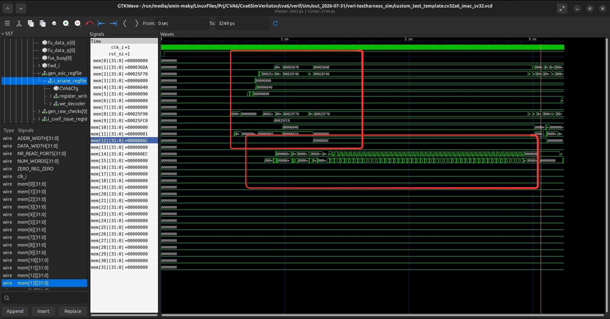
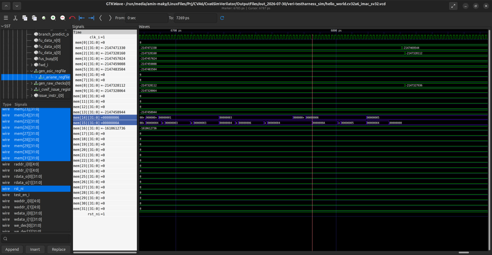

# CVA6 RISC-V Processor Simulation Guide

This repository documents the complete process of setting up, building, and simulating the **CVA6 RISC-V processor core** using Verilator and Spike. CVA6 is an open-source, application-class RISC-V CPU developed by OpenHW Group.

---

## 1. Environment & Repository Setup

### System Requirements

Before starting, ensure your system meets the following requirements:

- **Operating System:** Linux (Ubuntu 20.04+ recommended)
- **File System:** `ext4` (NTFS will **not** work)
- **Available Storage:** Minimum **40 GB free space** (for toolchain build artifacts and simulation outputs)
- **Network:** Stable internet connection with VPN/proxy (due to access restrictions to GitHub and external sources)

> ⚠️ **Critical:** Windows is not supported. The entire workflow must run on a native Linux partition formatted as ext4.

---

### Cloning the CVA6 Repository

Clone the CVA6 repository along with all its submodules:

```bash
git clone https://github.com/openhwgroup/cva6.git
cd cva6
git submodule update --init --recursive
```

**Common Issues:**
- **Network interruptions:** Use a reliable VPN to avoid incomplete downloads
- **Submodule failures:** If submodules fail to clone completely, delete corrupted directories and re-run:
  ```bash
  rm -rf <failed-submodule-path>
  git submodule update --init --recursive
  ```

---

### Installing System Dependencies

Update your package list and install required tools:

```bash
sudo apt-get update
sudo apt-get install cmake help2man device-tree-compiler
```
Verify CMake installation:

```bash
cmake --version
```
---

### Setting Up Python Virtual Environment

The verification framework requires Python dependencies. Install them in an isolated virtual environment:

1. **Install Python venv support:**
   ```bash
   sudo apt-get install python3-full
   ```

2. **Create a virtual environment:**
   ```bash
   python3 -m venv venv_cva6
   ```

3. **Activate the environment:**
   ```bash
   source venv_cva6/bin/activate
   ```

4. **Install Python dependencies:**
   ```bash
   pip3 install -r verif/sim/dv/requirements.txt
   ```

> **Note:** If this step fails with errors related to random instruction generation, you can safely ignore them — they are not required for basic simulation.

---
## 2. Building RISC-V GCC Toolchain

The CVA6 verification framework requires a **custom RISC-V GCC toolchain** with CVA6-specific patches. Building it from source ensures compatibility with the processor's verification tests.

---

### Installing Build Prerequisites

Before building the toolchain, install the required development tools:

```bash
sudo apt-get install autoconf automake autotools-dev curl python3 \
libmpc-dev libmpfr-dev libgmp-dev gawk build-essential bison flex \
texinfo gperf libtool patchutils bc zlib1g-dev libexpat-dev git
```

These packages provide:
- **Compilers & build tools:** `gcc`, `g++`, `make`, `autoconf`
- **Libraries:** `libmpc`, `libmpfr`, `libgmp` (required for GCC compilation)
- **Utilities:** `bison`, `flex`, `texinfo` (for parsing and documentation generation)

---

### Setting Up Environment Variables

The toolchain installation path must be defined in the `$RISCV` environment variable.

1. **Choose an installation directory:**
   ```bash
   export RISCV=/path/to/your/riscv-toolchain
   ```
   Example:
   ```bash
   export RISCV=$HOME/riscv
   ```

2. **Make the setting persistent** by adding it to your `~/.bashrc`:
   ```bash
   echo 'export RISCV=$HOME/riscv' >> ~/.bashrc
   echo 'export PATH=$RISCV/bin:$PATH' >> ~/.bashrc
   source ~/.bashrc
   ```

3. **Verify the variable is set:**
   ```bash
   echo $RISCV
   ```

> ⚠️ **Important:** The `$RISCV` variable must be set **before** running the build script. All binaries will be installed to `$RISCV/bin`.

---

### Downloading and Building the Toolchain

CVA6 provides an automated script to download sources and build the toolchain with the necessary patches.

1. **Navigate to the toolchain builder directory:**
   ```bash
   cd cva6/util/toolchain-builder
   ```

2. **(Optional) Configure parallel build jobs** to speed up compilation:
   ```bash
   export NUM_JOBS=$(nproc)
   ```
   This uses all available CPU cores. Adjust manually if needed:
   ```bash
   export NUM_JOBS=8
   ```

3. **Run the build script:**
   ```bash
   bash get-toolchain.sh
   ```

   **What this script does:**
   - Downloads GCC, Binutils, and Newlib sources from official repositories
   - Applies **CVA6-specific patches** required for proper simulation
   - Configures the toolchain for `riscv64-unknown-elf` target
   - Compiles and installs binaries to `$RISCV/bin`

> ⚠️ **Network Issues:** If you experience download failures due to restricted access to GitHub or GNU mirrors, use a reliable **VPN or proxy**. Partial downloads will cause build errors later.

---

### Build Duration and Resource Usage

- **Time:** Expect **1-3 hours** depending on your CPU (4-8 cores)
- **Disk Space:** The build process requires approximately **8-10 GB** of temporary space
- **RAM:** At least **4 GB** recommended during compilation

---

### Common Build Errors and Solutions

#### Error 1: Architecture Mismatch
**Symptom:**

configure: error: cannot guess build type; you must specify one

**Solution:**
Update `config.guess` and `config.sub` in the source directories:
```bash
cd <toolchain-source-directory>
wget -O config.guess 'https://git.savannah.gnu.org/gitweb/?p=config.git;a=blob_plain;f=config.guess;hb=HEAD'
wget -O config.sub 'https://git.savannah.gnu.org/gitweb/?p=config.git;a=blob_plain;f=config.sub;hb=HEAD'
```
---

#### Error 2: CMake Version Conflict
**Symptom:**

CMake Error: CMake 3.14 or higher is required

**Solution:**
Verify your CMake version and upgrade if necessary:
bash
cmake --version
sudo apt-get install --only-upgrade cmake

---

#### Error 3: Incomplete Source Downloads
**Symptom:**
Build fails with "file not found" or "tar: Unexpected EOF"

**Solution:**
1. Delete corrupted source archives:
   ```bash
   rm -rf build/
   ```
2. Re-run the build script with stable network connection
3. Use a VPN if GitHub/GNU servers are blocked

---

### Verifying the Installation

After the build completes successfully, verify the toolchain:

1. **Check GCC installation:**
   ```bash
   $RISCV/bin/riscv64-unknown-elf-gcc --version
   ```
   Expect
 output like: `riscv64-unknown-elf-gcc (GCC) 13.1.0`

2. **Test compilation:**
   Create a test file `test.c`:
   ```c
   int main() { return 0; }
   ```
   Compile it:
   ```bash
   $RISCV/bin/riscv64-unknown-elf-gcc -march=rv64imac -mabi=lp64 -O2 test.c -o test
   ```
   If no errors are thrown, the toolchain is functional.
---
## 3. Simulators Setup & Smoke Test

After building the toolchain, the next step is to prepare the simulation environment. CVA6 uses **Verilator** for RTL simulation and **Spike** as a golden reference ISA simulator. This section covers their installation, critical compatibility fixes, and running the smoke test to verify core functionality.

---

### Setting Up Environment Variables

Before building the simulators, configure the simulation environment:

```bash
cd cva6
source verif/sim/setup-env.sh
```

This script sets up paths and environment variables required by the verification framework.

Define the simulators you want to use:

```bash
export DV_SIMULATORS=veri-testharness,spike
```

- **`veri-testharness`:** Verilator-based hardware simulation
- **`spike`:** RISC-V ISA simulator used as reference for trace comparison

Set parallel build jobs to speed up compilation:

```bash
export NUM_JOBS=$(nproc)
```

---

### Critical Compatibility Fixes

Due to differences in CMake versions and modern GCC compilers, two manual patches are required before building the simulators.

#### Fix 1: CMake Version Compatibility

The `yaml-cpp` library used by Spike requires CMake 3.14+, but if you have an older system CMake or want to avoid conflicts, you can relax this requirement.

**Edit the CMakeLists.txt file:**

```bash
nano verif/core-v-verif/vendor/riscv/riscv-isa-sim/yaml-cpp/CMakeLists.txt
```

**Change line 2 from:**

```cmake
cmake_minimum_required(VERSION 3.14)
```

**To:**

```cmake
cmake_minimum_required(VERSION 3.5)
```

Save and exit (`Ctrl+O`, `Enter`, `Ctrl+X`).

---

#### Fix 2: Missing Header for GCC 15+

Modern GCC versions (15+) require explicit inclusion of `<cstdint>` for standard integer types. This header is missing from one of Spike's source files.

**Edit the emitterutils.cpp file:**

```bash
nano verif/core-v-verif/vendor/riscv/riscv-isa-sim/yaml-cpp/src/emitterutils.cpp
```

**Add the following line at the very top** (before any other includes):

```cpp
#include <cstdint>
```

Save and exit.

> **Why this fix is needed:** GCC 15 removed implicit inclusion of certain standard library headers. Without `<cstdint>`, compilation will fail with "unknown type name" errors for `uint8_t`, `uint32_t`, etc.

---

### Cleaning Incomplete Builds

If you've attempted to build before applying the fixes, you must clean incomplete build artifacts:

```bash
rm -rf verif/core-v-verif/vendor/riscv/riscv-isa-sim/build
rm -rf verif/core-v-verif/vendor/riscv/riscv-isa-sim/yaml-cpp/build
rm -rf tools/spike
```

This ensures a clean rebuild with the patches applied.

---

### Running the Smoke Test

The smoke test is a quick validation suite that confirms the core, toolchain, and simulators are working correctly. It runs a small set of regression tests and compares Verilator traces against Spike.

**Choose your target configuration** and run the corresponding smoke test script:

```bash
bash verif/regress/smoke-tests-<cpu_version>.sh
```

Replace `<cpu_version>` with one of the following:

- **`cv32a65x`** — 32-bit core with extensions
- **`cv32a6_imac_sv32`** — 32-bit core with I, M, A, C extensions and Sv32 MMU
- **`cv64a6_imafdc_sv39`** — 64-bit core with I, M, A, F, D, C extensions and Sv39 MMU

**Example:**

```bash
bash verif/regress/smoke-tests-cv32a6_imac_sv32.sh
```

---

### What the Smoke Test Does

The smoke test:

1. **Compiles test programs** using the RISC-V toolchain
2. **Runs them on Verilator** (hardware simulation)
3. **Runs them on Spike** (ISA reference simulator)
4. **Compares execution traces** between the two
5. **Reports PASS/FAIL** for each test

If all tests pass, your environment is correctly configured.

---

### Common Issues During Smoke Test

#### Issue 1: CMake Version Error

**Symptom:**

CMake Error at CMakeLists.txt:2 (cmake_minimum_required):
  CMake 3.14 or higher is required.


**Solution:**  
Apply **Fix 1** above, then clean and rebuild:

```bash
rm -rf verif/core-v-verif/vendor/riscv/riscv-isa-sim/build
bash verif/regress/smoke-tests-cv32a6_imac_sv32.sh
```

---

#### Issue 2: Mi
ising stdint types (GCC 15)

**Symptom:**  
Compilation error in `emitterutils.cpp` stating `uint8_t` or `uint32_t` was not declared.

**Solution:**  
Apply **Fix 2** above, then clean and rebuild:

```bash
rm -rf verif/core-v-verif/vendor/riscv/riscv-isa-sim/build
bash verif/regress/smoke-tests-cv32a6_imac_sv32.sh
```

---
## 4. Running Custom C & Assembly Tests

After successfully passing the smoke tests, you can now run your own custom test programs on the CVA6 core. This section covers compiling C and assembly code, generating waveforms for debugging, and analyzing simulation results.

---

### Verifying Toolchain Installation

Before running custom tests, confirm that the RISC-V toolchain is properly installed and accessible.

**Check GCC version:**

```bash
$RISCV/bin/riscv-none-elf-gcc --version
```

**Expected output:**

riscv-none-elf-gcc (GCC) 13.1.0
Copyright (C) 2023 Free Software Foundation, Inc.
This is free software; see the source for copying conditions.  There is NO
warranty; not even for MERCHANTABILITY or FITNESS FOR A PARTICULAR PURPOSE.


**List installed binaries:**

```bash
ls $RISCV/bin
```

**Expected output:**
```bash
riscv-none-elf-addr2line  riscv-none-elf-gcc         riscv-none-elf-gcov-dump  riscv-none-elf-nm       riscv-none-elf-strings
riscv-none-elf-ar         riscv-none-elf-gcc-13.1.0  riscv-none-elf-gcov-tool  riscv-none-elf-objcopy  riscv-none-elf-strip
riscv-none-elf-as         riscv-none-elf-gcc-ar      riscv-none-elf-gprof      riscv-none-elf-objdump
riscv-none-elf-c++filt    riscv-none-elf-gcc-nm      riscv-none-elf-ld         riscv-none-elf-ranlib
riscv-none-elf-cpp        riscv-none-elf-gcc-ranlib  riscv-none-elf-ld.bfd     riscv-none-elf-readelf
riscv-none-elf-elfedit    riscv-none-elf-gcov        riscv-none-elf-lto-dump   riscv-none-elf-size
```

**Make the toolchain permanently available** by adding it to your PATH:

```bash
echo 'export PATH=$RISCV/bin:$PATH' >> ~/.bashrc
source ~/.bashrc
```

---

### Setting Up Simulation Environment

Navigate to the simulation directory and configure the environment:

```bash
cd cva6/verif/sim
source verif/sim/setup-env.sh
```

Set the simulators to use:

```bash
export DV_SIMULATORS=veri-testharness,spike
```

Enable parallel builds:

```bash
export NUM_JOBS=$(nproc)
```

---

### Enabling Waveform Output

To generate VCD waveform files for debugging in GTKWave, you must enable trace generation before running the simulation.

**Set trace environment variables:**

```bash
export TRACE_FAST=1
unset TRACE_COMPACT
```

- **`TRACE_FAST=1`:** Enables fast VCD waveform generation
- **`unset TRACE_COMPACT`:** Disables compact trace mode (discovered through experimentation; not documented in official README)

> **Why `unset TRACE_COMPACT`?** By default, the simulation framework may use a compact trace format that is not compatible with GTKWave. Unsetting this variable ensures full VCD output.

---

### Running a Custom C Test

The CVA6 verification framework uses `cva6.py` to orchestrate test compilation, simulation, and trace comparison.

**Example: Running a simple C program**

```bash
cd verif/sim
python3 cva6.py --target cv32a6_imac_sv32 --iss=$DV_SIMULATORS --iss_yaml=cva6.yaml \
--c_tests ../tests/custom/hello_world/hello_world.c \
--linker=../../config/gen_from_riscv_config/linker/link.ld \
--gcc_opts="-static -mcmodel=medany -fvisibility=hidden -nostdlib \
-nostartfiles -g ../tests/custom/common/syscalls.c \
../tests/custom/common/crt.S -lgcc \
-I../tests/custom/env -I../tests/custom/common"
```

**Command breakdown:**

- **`--target cv32a6_imac_sv32`:** Specifies the CVA6 core configuration (32-bit with I, M, A, C extensions and Sv32 MMU)
- **`--iss=$DV_SIMULATORS`:** Uses both Verilator and Spike for simulation and comparison
- **`--iss_yaml=cva6.yaml`:** Configuration file for the ISA simulator
- **`--c_tests`:** Path to your C source file
- **`--linker`:** Linker script that defines memory layout
- **`--gcc_opts`:** Compilation flags:
  - **`-static`:** Static linking (no dynamic libraries)
  - **`-mcmodel=medany`:** Medium any code model for RISC-V (allows access to full address space)
  - **`-fvisibility=hidden`:** Hide symbols by default
  - **`-nostdlib -nostartfiles`:** Don't link standard library or default startup files (bare-metal)
  - **`-g`:** Include debug information
  - **`syscalls.c` and `crt.S`:** Required runtime support files for syst
alls and hardware initialization.

---

### Running a Custom Assembly Test

To run assembly-based tests, replace `--c_tests` with `--asm_tests`.

```bash
python3 cva6.py --target cv32a6_imac_sv32 --iss=$DV_SIMULATORS --iss_yaml=cva6.yaml \
--asm_tests ../tests/custom/hello_world/custom_test_template.S \
--linker=../../config/gen_from_riscv_config/linker/link.ld \
--gcc_opts="-static -mcmodel=medany -fvisibility=hidden -nostdlib \
-nostartfiles ../tests/custom/common/syscalls.c \
../tests/custom/common/crt.S -lgcc \
-I../tests/custom/env -I../tests/custom/common"
```

---

### Cleaning Simulation Outputs

If you need to re-run a simulation cleanly, you must remove the generated output directories, which contain the VCD files, logs, and compiled binaries from previous runs.

```bash
cd verif/sim
rm -rf out_<date_timestamp>
```

---

### Analyzing Waveforms with GTKWave

After a successful simulation, a `.vcd` file is generated in the `out_...` directory. Open it with GTKWave to view the signal traces:

```bash
gtkwave <path_to_vcd_file>
```
---
## 5. Waveform Debugging & Architectural Signal Analysis

After running a test successfully, the next challenge is understanding what happened inside the processor. This section covers how to navigate the CVA6 architecture in GTKWave, locate critical hardware modules, and interpret register file activity during program execution.

---

### Why Simple Tests Matter for Debugging

While `hello_world.c` demonstrates full functionality, it generates **thousands of signal transitions** across the entire processor pipeline, making manual inspection extremely difficult.

For learning and debugging, use **minimal assembly tests** that execute only a few instructions. This allows you to:

- Clearly see the effect of each instruction on the register file
- Understand pipeline stages without noise
- Verify arithmetic/logic operations manually
- Distinguish between your code and startup/shutdown routines

---

### Example: A Minimal XOR Test

Create a simple assembly test that performs an XOR operation:

```assembly
.globl main
main:
  # Core test logic
  li a0, 0xCAFE;       # Load 0xCAFE into register a0
  li a1, 0xCAFE;       # Load 0xCAFE into register a1
  xor a2, a0, a1;      # XOR a0 and a1, store result in a2
  beqz a2, pass;       # Branch to 'pass' if a2 == 0

fail:
  li a0, 0x0;
  jal exit;

pass:
  li a0, 0x0;
  jal exit;
```

**Expected behavior:**

- `a0` and `a1` both receive `0xCAFE`
- `a2 = a0 XOR a1 = 0x00000000` (XOR of identical values is always zero)
- Branch to `pass` is taken because `a2 == 0`

> **Note:** CVA6's verification framework uses **Spike** (a RISC-V ISA simulator) as a golden reference. Spike extracts expected signal values from your code and compares them against Verilator's RTL simulation. If they match, the test passes. However, for deeper understanding, we analyze the waveforms manually rather than relying solely on automated pass/fail results.

---

### Navigating the CVA6 Architecture in GTKWave

CVA6 is an **out-of-order processor**, meaning its pipeline structure differs from simple in-order designs. The register file is not located in the Decode stage — it resides in the **Issue stage**.

**Hierarchical path to the register file:**

    TOP
    └── ariane_testharness      (top-level testbench)
        └── i_ariane            (CVA6 core wrapper)
            └── i_cva6          (CVA6 processor core)
                └── issue_stage_i               (Issue stage)
                    └── i_issue_read_operands   (Operand read logic)
                        └── gen_asic_regfile
                            └── i_ariane_regfile   (Register file)


**How to locate it in GTKWave:**

1. Open your VCD file in GTKWave
2. In the **SST (Signal Search Tree)** panel on the left, expand modules in this order:
   - `TOP`
   - `ariane_testharness`
   - `i_ariane`
   - `i_cva6`
   - `issue_stage_i`
   - `i_issue_read_operands`
   - `gen_asic_regfile`
   - `i_ariane_regfile`

3. Click on `i_ariane_regfile` to see its signals in the **Signals panel** below
  
*Figure 1: Navigating the CVA6 module hierarchy to locate the register file in GTKWave*
---

### Selecting Register File Signals

The register file contains an array called `mem[0..31]`, where each entry corresponds to a RISC-V register:

- `mem[0]` = `x0` (hardwired to zero)
- `mem[10]` = `a0` (first argument register)
- `mem[11]` = `a1` (second argument register)
- `mem[12]` = `a2` (third argument register)
- ...and so on

**Insert these signals into the waveform viewer:**

1. Select `clk_i` (clock signal)
2. Select `rst_ni` (active-low reset)
3. Select `mem[10]` (register `a0`)
4. Select `mem[11]` (register `a1`)
5. Select `mem[12]` (register `a2`)
6. Click **Insert** to add them to the waveform view


*Figure 2: Register file signals validating the functional integrity of the design (pay close attention to the highlighted signals).*

> **Tip:** The magnifying glass icon in GTKWave is for **searching within the currently selected module's signals**, not for navigating the module hierarchy.

---

### Analyzing the Waveform

Open your VCD file:

```bash
gtkwave <path_to_vcd>/custom_test_template.cv32a6_imac_sv32.vcd
```

**What to observe:**

#### 1. **Initialization (Startup Code)**

Before your `main` function executes, the register file experiences **many transitions**. This is caused by:

- **`crt.S` (
C Runtime):** Code that initializes the stack pointer (`sp`), global pointer (`gp`), and zeroes out `.bss` segments before jumping to `main`.
- **Syscalls:** If your code uses standard library functions (like `printf`), the simulator triggers an `ECALL`, which invokes Spike to handle I/O and modifies registers used by the system call mechanism.

*You will see `a0`, `a1`, and `a2` change frequently during this setup phase.*


*Figure 3: Heavy register activity during initialization before `main` execution*

#### 2. **Execution (Main Code)**

Once the program reaches `main` (the point of interest):

1. **`li a0, 0xCAFE`:** Monitor `mem[10]`. It should jump to `0x0000CAFE` at the next rising clock edge.
2. **`li a1, 0xCAFE`:** Monitor `mem[11]`. It should jump to `0x0000CAFE`.
3. **`xor a2, a0, a1`:** Monitor `mem[12]`. It should become `0x00000000`.

*If these transitions occur exactly as predicted, your RTL implementation of the Integer Unit and Register File is functioning correctly.*

---
## 6. Deep Dive: C Code Analysis & HTIF Communication Mechanism

After validating the basic functionality of CVA6 with simple assembly tests, the next step is to understand how **high-level C code translates to hardware execution** and how the simulated processor communicates with the outside world for I/O operations like `printf`.

This section covers:
- **Disassembly analysis:** Reading the compiled object dump to trace variable-to-register mapping
- **Loop verification:** Monitoring register values to confirm correct program flow
- **HTIF discovery:** Understanding why UART signals remain idle and how bare-metal `printf` actually works

---

### Test Program: A Simple Loop with Accumulation

To validate correct execution, we'll use a C program that performs an **accumulation loop** before exiting:

```c
#include <stdint.h>
#include <stdio.h>

int main(int argc, char* argv[]) {
  
  printf("%d: Hello World !", 0);
  
  int a = 0;
  for (int i = 0; i < 5; i++)
  {
    a += i;
  }
  return 0;
}
```

**Expected behavior:**

- `a` starts at `0`
- Loop iterates 5 times: `i = 0, 1, 2, 3, 4`
- Each iteration: `a += i`
- Final value: `a = 0 + 1 + 2 + 3 + 4 = 10 (0x0000000A)`

By identifying which **registers** the compiler assigns to `a` and `i`, we can monitor them in GTKWave and verify that the hardware correctly executes the loop.

---

### Generating the Disassembly (Object Dump)

To see how the compiler translated our C code into RISC-V assembly, we generate a **disassembly** using `objdump`:

```bash
$RISCV/bin/riscv-none-elf-objdump -d <path_to_elf_file> > hello_world.dump
```

The `.dump` file contains:
- **Memory addresses** (left column)
- **Machine code** (hex, middle column)
- **Assembly instructions** (right column)

> **Note:** This file is **large** because a single `printf` call expands into hundreds of assembly instructions for string formatting, memory operations, and system call setup.

---

### Locating the `main` Function

Search for the `main` function in the dump file:

```assembly
80003000 <main>:
80003000:  7179                  add   sp,sp,-48
80003002:  d606                  sw    ra,44(sp)
80003004:  d422                  sw    s0,40(sp)
80003006:  1800                  add   s0,sp,48
80003008:  fca42e23              sw    a0,-36(s0)
8000300c:  fcb42c23              sw    a1,-40(s0)
80003010:  4581                  li    a1,0
80003012:  00002517              auipc a0,0x2
80003016:  fee50513              add   a0,a0,-18 # 80005000 <_end_text>
8000301a:  675000ef              jal   80003e8e <printf>
8000301e:  fe042623              sw    zero,-20(s0)
80003022:  fe042423              sw    zero,-24(s0)
80003026:  a829                  j     80003040 <main+0x40>
80003028:  fec42703              lw    a4,-20(s0)
8000302c:  fe842783              lw    a5,-24(s0)
80003030:  97ba                  add   a5,a5,a4
80003032:  fef42623              sw    a5,-20(s0)
80003036:  fe842783              lw    a5,-24(s0)
8000303a:  0785                  add   a5,a5,1
8000303c:  fef42423              sw    a5,-24(s0)
80003040:  fe842703              lw    a4,-24(s0)
80003044:  4791                  li    a5,4
80003046:  fee7d1e3              bge   a5,a4,80003028 <main+0x28>
8000304a:  4781                  li    a5,0
8000304c:  853e                  mv    a0,a5
8000304e:  50b2                  lw    ra,44(sp)
80003050:  5422                  lw    s0,40(sp)
80003052:  6145                  add   sp,sp,48
80003054:  8082                  ret
```

**Column structure:**
- **Left:** Memory address (e.g., `80003008`)
- **Middle:** Machine code in hex (e.g., `fca42e23`)
- **Right:** Assembly instruction (e.g., `sw a0,-36(s0)`)

---

### Analysis: Identifying Register Assignments

#### **Section 1: Prologue and `printf` Call (80003000 – 8000301a)**

- **80003000 – 80003006:** Stack frame setup. Allocates 48 bytes on the stack, saves return address (`ra`) and frame pointer (`s0`).
- **80003008 – 8000300c:** Stores function arguments `argc` and `argv` onto the stack at offsets `-36(s0)` and `-40(s0)`.
- **80003010:** Loads `0` i
.e., the first argument of `printf` (`%d: Hello World !`, 0) into `a1`.
- **8000301a:** Calls `printf` (address `80003e8e`).

#### **Section 2: Loop Initialization (8000301e – 80003026)**

- **8000301e:** Sets local variable `a` to `0` (stored on stack at `-20(s0)`).
- **80003022:** Sets loop index `i` to `0` (stored on stack at `-24(s0)`).
- **80003026:** Jumps unconditionally to `80003040` to evaluate the loop condition.

#### **Section 3: The Loop (80003028 – 8000303c)**

This is where the actual accumulation happens:

- **80003028:** Loads variable `a` into register `a4`.
- **8000302c:** Loads variable `i` into register `a5`.
- **80003030:** `add a5, a5, a4` -> Adds `i` to `a` and stores result in `a5`.
- **80003032:** Stores the new `a` back to the stack `-20(s0)`.
- **80003036:** Loads `i` into `a5`.
- **8000303a:** `add a5, a5, 1` -> Increment `i`.
- **8000303c:** Stores incremented `i` back to the stack `-24(s0)`.

#### **Section 4: Loop Condition (80003040 – 80003046)**

- **80003040:** Loads the updated `i` into `a4`.
- **80003044:** Loads `4` into `a5`.
- **80003046:** `bge a5, a4, 80003028` -> If `4 >= i`, branch back to the start of the loop (`80003028`).

---

### The HTIF (Host-Target Interface) Mystery

If you inspect the GTKWave signals, you will notice that the `UART_TX` line is **completely silent** (stays high/idle).

**Why?**
The CVA6 environment is set up for bare-metal simulation. It doesn't include a fully synthesized UART peripheral by default. Instead, it uses **HTIF** to communicate with the host.

1.  **Memory-Mapped Write:** When `printf` executes, it performs a store operation to a specific memory address (often referred to as `tohost`).
2.  **Simulation Detection:** The CVA6 Verilator testbench monitors the memory bus. When it detects a store to the `tohost` address, it interprets the data as a character or command and prints it to the simulation console.
3.  **Efficiency:** This allows fast console output without needing to simulate the timing of a slow UART serial interface.


*Figure 4: Comparing I/O candidate modules. The `UART` bus (blue) stays idle while `i_sram` (yellow) shows the actual memory-mapped write activity used by HTIF.*

**Debug Tip:**
If your code hangs before printing, check the `tohost` signal in GTKWave. If you see the value `0x00000001` or similar being written to that address, the processor is trying to send data via HTIF, but the host might be waiting for more data, or the program might have crashed before completing the transfer.

---

### Verification Steps in GTKWave

1.  **Add Signals:**
    *   Find `i_issue_read_operands` in the hierarchy.
    *   Monitor the inputs/outputs corresponding to register reads (`rs1`, `rs2`) and writes (`rd`).
2.  **Monitor Registers `a4` and `a5`:**
    *   Watch their transitions as the simulation passes address `80003030` (the add instruction).
    *   Confirm that `a5` correctly updates to `1, 3, 6, 10`.
    
*Figure 5: Register file activity showing `mem[14]` (a4) and `mem[15]` (a5) accumulating the loop values (1, 3, 6, 10) exactly as predicted from the disassembly.*

3.  **Confirm Loop Termination:**
    *   Watch the branch instruction at `80003046`.
    *   Verify that once `a4` (the index) exceeds `4`, the branch is *not* taken, and the program flows to the `ret` instruction.

---
### Final Verification: Catching the ASCII on the Bus

Verifying the loop registers (`a4`/`a5`) proves the **computation** is correct, but it doesn't prove the **I/O path** works. The final piece of evidence is catching the actual `"Hello World !"` characters as raw bytes on the memory write bus.

Since `printf` in this bare-metal environment ultimately writes characters through memory-mapped HTIF stores, each character of the string must appear — as its ASCII code — on the write-data bus (`wdata_i`) of the memory subsystem.

**ASCII Reference for the Expected String:**

| Char | `H`  | `e`  | `l`  | `l`  | `o`  | ` `  | `W`  | `o`  | `r`  | `l`  | `d`  | ` `  | `!`  |
|------|------|------|------|------|------|------|------|------|------|------|------|------|------|
| Hex  | 0x48 | 0x65 | 0x6C | 0x6C | 0x6F | 0x20 | 0x57 | 0x6F | 0x72 | 0x6C | 0x64 | 0x20 | 0x21 |

**Observation in GTKWave:**

Between roughly `5200 ps` and `5500 ps`, the register file entries `mem[14]` (a4) and `mem[15]` (a5) and the memory bus show the character bytes moving through the datapath: `0x48`, `0x65`, `0x6C`, `0x6C`, `0x6F` — spelling out `H`, `e`, `l`, `l`, `o`.


*Figure 6: The ASCII codes of "Hello" (0x48, 0x65, 0x6C, 0x6C, 0x6F) captured on the write-data path. Each byte matches the reference table above, proving the string physically traversed the hardware.*

> **Note:** CVA6 is a 64-bit core, so the bus is 64 bits wide. Depending on how the runtime buffers the string, a single bus transaction may carry **multiple characters packed into one word** (e.g., `0x6C6C65480000...`), or characters may appear one-by-one in the low byte. Either way, the ASCII values are identifiable by inspecting the byte lanes of `wdata_i`.

**Clarifying the `tohost` value:**

A common point of confusion: near the end of simulation, `tohost` is written with the value `1`. This is **not** character data. In the HTIF protocol, writing `(exit_code << 1) | 1` to `tohost` signals program termination — so a value of `1` means `exit_code = 0`, i.e., **the program finished successfully** (matching `return 0;` in `main`).

---

### Conclusion: End-to-End Proof of Functionality

At this point, the verification chain is complete at every level of abstraction:

1. **Software level:** The C source compiles to the expected RISC-V assembly (confirmed via `objdump`).
2. **Computation level:** The register file shows `a4`/`a5` accumulating `1, 3, 6, 10` — the loop executes exactly as the disassembly predicts (Figure 5).
3. **I/O level:** The ASCII bytes of `"Hello World !"` are physically observed on the memory write bus (Figure 6), confirming the HTIF path from `printf` down to RTL signals.
4. **Termination level:** `tohost = 1` confirms a clean exit with code `0`.

This closes the loop between **what the programmer wrote** and **what the silicon (simulated RTL) actually did** — an end-to-end proof that the CVA6 core, the toolchain, and the simulation environment all function correctly together.
`
