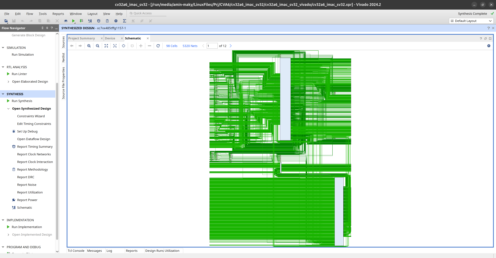
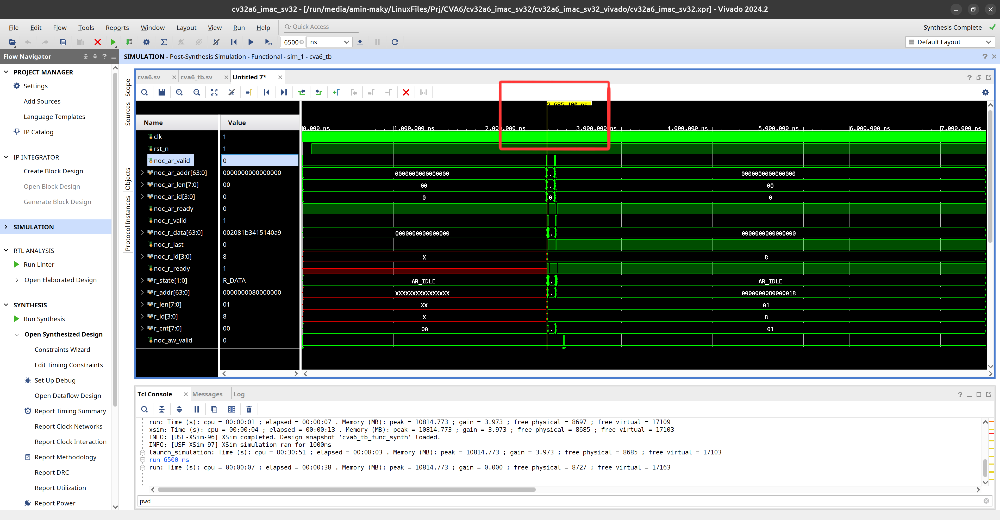
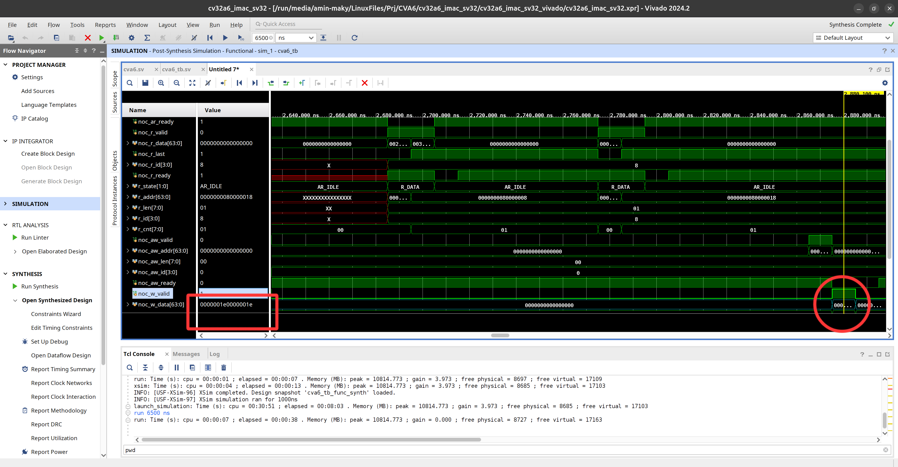

# CVA6 RISC-V Core — Vivado Synthesis Guide

This guide covers the complete process of synthesizing the CVA6 core in Xilinx Vivado. CVA6 is a 64-bit/32-bit RISC-V core developed by the OpenHW Group, optimized for FPGA implementation.

---

## 1. Overview

**Goal:** Successfully synthesize CVA6 in Vivado and demonstrate its implementability on FPGA hardware.

**Core Challenge:**  
The CVA6 project consumes a large amount of resources. Direct behavioral simulation with xsim may fail with an Out-of-Memory error due to the construction of large arrays.

**Solution:**  
- Run Synthesis on the project  
- Run Post-Synthesis Simulation instead of behavioral simulation

> **Why this works:**  
> After synthesis, Vivado produces an optimized representation of the design that requires significantly less RAM to simulate. According to Dr. Mahani, this is a standard solution for large projects in the xsim environment.

---

## 2. Prerequisites

### System Requirements
- **RAM:** Minimum 16 GB (for systems with less RAM, only the synthesis + post-synthesis approach is viable)
- **OS:** Linux (Ubuntu 20.04/22.04 recommended) or Windows with WSL2
- **Vivado Version:** Requires Vivado 2024.2 or newer (older versions may not be fully compatible). Although the upstream CVA6 developers originally implemented the design with Vivado 2018.2, this project was built, synthesized, and verified using Vivado 2024.2.
### Tools Required
- **Git:** For cloning the repository
- **CVA6 Repository:** Tested and verified on commit `41e30493046e7719ff59b77af5a6f0e436066a55`

   (Use `git checkout 41e3049...` to ensure full reproducibility).

- **Bender:** SystemVerilog dependency manager for PULP Platform projects
- **Vivado Design Suite:** For synthesis and implementation

---

## 3. Step-by-Step Synthesis Flow

### Step 1: Clone the CVA6 Repository

```bash
git clone --recursive https://github.com/openhwgroup/cva6.git
cd cva6
```
> **Important:**  
> Always use the `--recursive` flag to clone all submodules (e.g., `axi`, `common_cells`, `tech_cells_generic`). Without these submodules, synthesis will fail with missing dependencies errors.

---

### Step 2: Install Bender (Dependency Manager)

CVA6 uses Bender to manage SystemVerilog files and dependencies.

#### Installation via Direct Download (Recommended):

1. Open your browser and navigate to:
   ```
   https://github.com/pulp-platform/bender/releases/latest
   ```

2. Under **Assets**, download the Linux binary:
   - The file is typically named `bender-x86_64-linux` or `bender-...-ubuntu20.04`

3. Move the downloaded file to the `cva6` root directory, rename it to `bender`, and make it executable:
   ```bash
   chmod +x bender
   sudo mv bender /usr/local/bin/bender
   ```

4. Verify the installation:
   ```bash
   bender --version
   ```
   The output should display the Bender version number (e.g., `0.27.3`).

> **Troubleshooting:**  
> If you get `command not found`, make sure `/usr/local/bin` is in your `PATH`:
> ```bash
> echo $PATH | grep "/usr/local/bin"
> ```

---

### Step 3: Generate Vivado TCL Script with Bender

Bender automatically generates a `.tcl` file that registers all required SystemVerilog files with Vivado.

```bash
bender script vivado -t <cpu_version> > cva6_files.tcl
```
**Choosing a CPU version:**  
Replace `<cpu_version>` with one of the following:

| Target | Description | ISA Extensions |
|--------|-------------|----------------|
| `cv32a65x` | 32-bit RISC-V core (lightweight) | RV32IMAC |
| `cv32a6_imac_sv32` | 32-bit with virtual memory | RV32IMAC + Sv32 MMU |
| `cv64a6_imafdc_sv39` | 64-bit full-featured core (most complex) | RV64IMAFDC + Sv39 MMU |

**Example:**
```bash
bender script vivado -t cv32a6_imac_sv32 > cva6_files.tcl
```
After running, `cva6_files.tcl` will be created in the same directory.

> **Note:**  
> If you get a `target not found` error, check `Bender.yml` to confirm the target is defined there.

---

### Step 4: Source the TCL Script in Vivado

Now run the TCL file inside Vivado to build the project.

#### Method 1: Via Tools Menu in GUI

1. Open Vivado
2. Go to **Tools → Run Tcl Script**
3. Select `cva6_files.tcl`
4. The project will be created automatically with all required files

#### Method 2: Via Vivado Tcl Console

1. Open Vivado
2. In the **Tcl Console** (bottom panel), navigate to the `cva6` directory:
   ```tcl
   cd /path/to/cva6
   ```
3. Source the TCL file:
   ```tcl
   source cva6_files.tcl
   ```

> **Expected Output:**  
> Vivado should begin adding SystemVerilog files and ultimately create a project with a top module (typically `cva6`).

---

### Step 5: Run Synthesis

Once the project is set up, start the synthesis flow:

1. In the Flow Navigator (left panel), click **Run Synthesis**
2. Vivado will begin analyzing and synthesizing the design
   - **Estimated time:** 10–30 minutes (depending on your system and selected CPU variant)
3. When complete, select **Open Synthesized Design**

#### Synthesis Results
After successful synthesis, you can inspect:

- **Schematic View:**  
  From the **Schematic** menu, you can view the hierarchical module structure

  
  
  *Figure 1: Schematic view of synthesized CVA6 core showing hierarchical module structure*

- **Resource Utilization:**  
  The **Utilization** report shows FPGA resource consumption (LUT, FF, BRAM, DSP)

---

### Step 6: Post-Synthesis Simulation (Recommended)

Due to memory constraints in behavioral simulation, post-synthesis simulation is recommended:

1. In the **Flow Navigator**, go to the **Simulation** section
2. Click **Run Simulation → Post-Synthesis Functional Simulation**
3. Vivado will automatically run the testbench (if available) against the synthesized design

> **Why Post-Synthesis Simulation Works:**  
> The synthesized design includes logical simplifications and optimizations that reduce simulation overhead. However, this simulation has no timing accuracy — for timing analysis, you must proceed to the Implementation stage.

#### 6.1 Why Behavioral Simulation Fails on This Project

Even with the lightest CVA6 configuration cloned from the official repository, `xsim` (Vivado's built-in simulator) failed to elaborate the behavioral model. The reported errors were related to extremely large internal arrays that the simulator tried to allocate — exceeding the 16 GB of system RAM available on the test machine.

As it turns out, this is a known limitation: **large designs frequently fail behavioral simulation under `xsim`**. The practical workaround is to *synthesize first* and then run a **Post-Synthesis Functional Simulation** on the resulting netlist. Surprisingly, the design not only passed synthesis, but the post-synthesis simulation ran correctly as well — effectively bypassing the `xsim` elaboration bug.

#### 6.2 Handling Out-of-Memory Errors with a Swap File

Both synthesis and post-synthesis simulation can still exhaust system RAM. The solution is to back the RAM with disk space by creating a **swap file**:
```bash
# Create a 16 GB file on any drive with free space
sudo fallocate -l 16G /path/with/free/space/swapfile

# Restrict permissions (required for swap)
sudo chmod 600 /path/with/free/space/swapfile

# Format the file as swap
sudo mkswap /path/with/free/space/swapfile

# Enable it
sudo swapon /path/with/free/space/swapfile
```
> **Note:** If the swap file lives on a drive that is mounted *after* login (e.g. `/run/media/<user>/<drive>`), you must re-run `sudo swapon <path>/swapfile` on every boot. If you create the swap file on the root/home partition instead, you can register it in `/etc/fstab` once and forget about it.

#### 6.3 The Flattened Netlist Problem

The CVA6 top module makes heavy use of user-defined SystemVerilog types for its ports. For example:

```systemverilog
// noc request, can be AXI or OpenPiton - SUBSYSTEM
output noc_req_t noc_req_o,
// noc response, can be AXI or OpenPiton - SUBSYSTEM
input  noc_resp_t noc_resp_i
```
where `noc_req_t` is a packed struct bundling the full AXI request channel:

```systemverilog
parameter type noc_req_t = struct packed {
axi_aw_chan_t aw;
logic         aw_valid;
axi_w_chan_t  w;
logic         w_valid;
logic         b_ready;
axi_ar_chan_t ar;
logic         ar_valid;
logic         r_ready;
}
```
This is great for readability and debugging at the RTL level — but **after synthesis, Vivado flattens all struct ports** into individual auto-named nets. The testbench must therefore match the *flattened* port names of the netlist, not the original RTL ports.

To discover the new names, export the synthesized netlist from the Tcl console:

```tcl
write_verilog -force cva6_netlist.v
```
(Use `pwd` in the Tcl console to see where the file will be written.) The resulting netlist is huge — over **5,142,000 lines** in this project — so search for the top module name to find its port list. Don't panic; this is completely normal.

You will encounter **escaped identifiers** such as:

```verilog
output [31:0] \rvfi_probes_o[csr][jvt_q] ;
```
In Verilog, a leading backslash (`\`) means *everything up to the first whitespace is part of the signal name* — which is why there is a mandatory space before the `;`. Your testbench must use these exact escaped names when connecting to the netlist.

#### 6.4 Testbench Architecture: An AXI Virtual RAM

Unlike simpler cores that embed an instruction memory internally, **CVA6 has no internal program memory** — it fetches instructions and performs data accesses over an **AXI** interface. This is actually a clean design choice: the system integrator defines exactly as much memory as needed, no more, no less.

The testbench therefore implements a **finite state machine (FSM) acting as a virtual RAM slave** on the AXI bus:

- It responds to read-address (`AR`) / read-data (`R`) transactions to serve instruction fetches
- It accepts write-address (`AW`) / write-data (`W`) transactions so the core can write results back
- Program contents are preloaded with:

```systemverilog
$readmemh("/path/to/firmware.hex", ram);
```
#### 6.5 Building the Firmware

The test program is a minimal RISC-V assembly file with one tactical trick: after computing the result, it **stores it to memory**, forcing the core to perform an AXI write that the testbench can observe — a self-checking handshake between core and testbench.

**`main.S`:**

```asm
.section .text
.global _start

_start:
li x1, 10           # x1 = 10 (0x0A)
li x2, 20           # x2 = 20 (0x14)
add x3, x1, x2      # x3 = 30 (0x1E)
# --- Write the result to memory ---
li x4, 0x80001000   # target memory address
sw x3, 0(x4)        # store x3 (the sum) to [x4]

loop:
j loop              # infinite loop to end the program

A linker script places the code at the CVA6 boot address:
```
**`link.ld`:**

```ld
OUTPUT_ARCH("riscv")
ENTRY(_start)

SECTIONS
{
/* Program start = CVA6 boot address */
. = 0x80000000;

.text : { *(.text) }
.data : { *(.data) }
.bss  : { *(.bss)  }
}
```

Compile to an ELF (32-bit core, `rv32imac`):

```bash
riscv-none-elf-gcc -march=rv32imac -mabi=ilp32 -nostdlib -T link.ld main.S -o firmware.elf
```

Then extract a Verilog-style hex file:

```bash
riscv-none-elf-objcopy -O verilog --verilog-data-width=4 \
--change-addresses -0x80000000 firmware.elf firmware.hex
```

> **Note:** The testbench RAM is indexed from 0, so `--change-addresses -0x80000000` shifts the boot address `0x80000000` down to `0`. Without this, `$readmemh` will fail to load the image.

#### 6.6 Simulation Results and Verification

After launching the post-synthesis functional simulation, **give the core time to complete its boot sequence** — meaningful bus activity only begins at around **2,685,000 ns** of simulation time:



*Figure 2: Full simulation window. The core remains quiet during boot; AXI read activity (instruction fetch) begins at ≈2,685,100 ns, visible as the burst of transitions on the `noc_ar_*` / `noc_r_*` channels and the `r_state` FSM leaving `AR_IDLE`.*

Once the program executes, the core issues an AXI write transaction carrying the computed result:



*Figure 3: Verification of the result. When `noc_w_valid` asserts, `noc_w_data[63:0]` carries `0x0000001e_0000001e` — the value 30 (0x1E) written by the `sw` instruction to address `0x80001000`, confirming correct end-to-end execution of the synthesized netlist.*

Simulation cost on the test machine (from the Tcl console): peak memory ≈ **10.8 GB**, with the initial `launch_simulation` taking ≈ 8 minutes — which is exactly why the swap file from Section 6.2 matters on a 16 GB system.

---

## 4. Common Issues & Solutions

### Issue 1: Bender Not Found

**Symptom:**

bash: bender: command not found

**Solution:**
```bash
which bender  # check if installed
export PATH=$PATH:/usr/local/bin  # add to PATH temporarily
echo 'export PATH=$PATH:/usr/local/bin' >> ~/.bashrc  # make permanent
source ~/.bashrc
```
---

### Issue 2: Synthesis Fails with Missing Files

**Symptom:**

ERROR: [Synth 8-439] module 'axi_node' not found

**Cause:** Submodules were not cloned.

**Solution:**
```bash
cd cva6
git submodule update --init --recursive
bender script vivado -t cv32a6_imac_sv32 > cva6_files.tcl
```
---

### Issue 3: Out-of-Memory in Behavioral Simulation

**Symptom:**

ERROR: [XSIM 43-3322] Static elaboration of top level VHDL design unit failed.

**Solution:**  
Use post-synthesis simulation (see Step 6). If behavioral simulation is strictly required, increase system RAM or configure swap space:

```bash
sudo fallocate -l 8G /swapfile
sudo chmod 600 /swapfile
sudo mkswap /swapfile
sudo swapon /swapfile
```
---

### Issue 4: Bender Target Not Recognized

**Symptom:**

Error: Target 'cv32a65x' not found in Bender.yml

**Solution:**  
Open `Bender.yml` and check the list of available targets:
bash
cat Bender.yml | grep -A 5 "targets:"

Use only targets defined in that file.

---

## 5. Understanding the Output

### Generated TCL File Structure

The `cva6_files.tcl` file generated by Bender contains commands that:

1. Create a new Vivado project
2. Add all `.sv` and `.v` source files to the project
3. Ensure correct compile order (based on dependencies)
4. Set the top module

**Example file content:**
tcl
### Create project
create_project cva6_synth ./vivado_project -part xc7a100tcsg324-1 -force

### Add source files
add_files -norecurse {
  ./src/ariane.sv
  ./src/alu.sv
  ./axi/src/axi_node.sv
  ...
}

### Set top module
set_property top ariane [current_fileset]

---

## 6. Next Steps

After a successful synthesis, you can continue with:

1. **Implementation:**  
   - Click **Run Implementation** to map the design onto the target FPGA  
   - Timing analysis is performed at this stage

2. **Generate Bitstream:**  
   - Click **Generate Bitstream**  
   - The resulting `.bit` file can be loaded onto the FPGA

3. **Post-Implementation Simulation:**  
   - Run this for full timing accuracy

---

## 7. Project Statistics

After successful synthesis of `cv32a6_imac_sv32`:

### Resource Utilization

| Resource | Used | Notes |
|----------|------|-------|
| Slice LUTs | 135,074 | Includes LUT as Logic, Memory, and SRL |
| Slice Registers | 327,292 | Total flip-flops used |
| F7 Muxes | 42,791 | 7-input multiplexers |
| F8 Muxes | 19,986 | 8-input multiplexers |
| Block RAM Tiles | 16 | On-chip block memory |
| DSPs | 4 | Digital signal processing units |
| Bonded IOBs | 4,979 | I/O pins |
| BUFGCTRL | 1 | Global clock control buffers |

### Slice Logic Breakdown

Based on the Utilization Hierarchy report:

- LUT as Logic: ~44%
- LUT as Memory: ~44%
- Register as Flip Flop: ~54%
- F7 Muxes: ~26%

### Top Resource-Consuming Modules

From **Reports → Utilization → Hierarchy**:

1. `csr_regfile_i` — CSR register file
2. `ex_stage_i` — Execution stage
3. `gen_cache_hpdc.i_cache_subsystem` — Cache subsystem
4. `gen_perf_counter.perf_counters_i` — Performance counters
5. `i_frontend` — Frontend
6. `id_stage_i` — Instruction decode stage
7. `issue_stage_i` — Issue stage

> **Important:** This design exceeds the capacity of an Artix-7 100T FPGA:
> - Artix-7 100T has only ~63,400 LUTs (135,074 used)
> - Artix-7 100T has only ~126,800 FFs (327,292 used)
>
> **Options for fitting on a smaller FPGA:**
> 1. Use a lighter target such as `cv32a65x`
> 2. Move to a higher-capacity device (e.g., Kintex-7 325T or 410T)
> 3. Disable non-essential features (performance counters, full cache config)

---


## 8. References

- [CVA6 Official Documentation](https://github.com/openhwgroup/cva6)
- [Bender Documentation](https://github.com/pulp-platform/bender)
- [Xilinx Vivado User Guide](https://www.xilinx.com/support/documentation-navigation/design-hubs/dh0010-vivado-design-hub.html)

---

## 9. Acknowledgments

This guide was prepared based on hands-on experience synthesizing CVA6, with guidance from Dr. Mahani. The synthesis + post-synthesis approach is an effective solution for working around memory limitations in large RISC-V projects.
